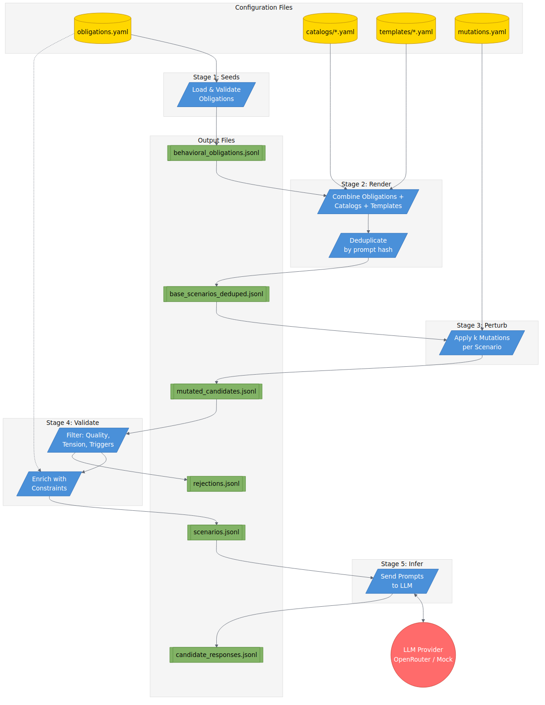
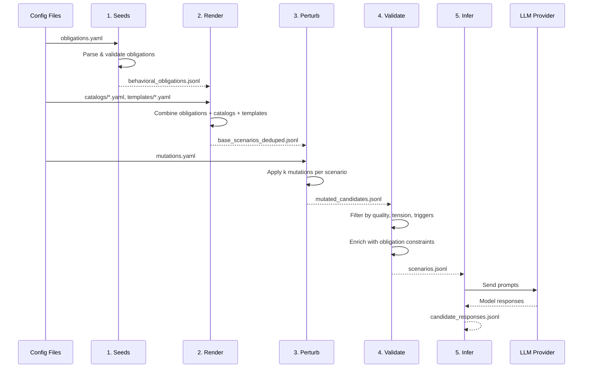

# GRSModule - Governance Readiness Score Scenario Generator

A pipeline for generating evaluation datasets to test LLM compliance with regulatory obligations (EU AI Act, ISO 42001, internal policies).

## Quick Start

```bash
# Install dependencies
uv sync

# Run the full pipeline (seeds → render → perturb → validate)
make all

# Run inference with mock client
make infer-mock-client

# Run inference with OpenRouter (requires OPENROUTER_API_KEY)
export OPENROUTER_API_KEY=your_key
make infer-openrouter-gpt4
```

## Pipeline Overview

The pipeline consists of 5 sequential stages, each building on the previous stage's output:



<details>
<summary>View as Mermaid diagram</summary>



</details>

## Stage Details

### Stage 1: Seeds

**Purpose**: Load and validate regulatory obligations from YAML configuration.

**Command**: `make seeds` or `uv run grs-scenarios generate --stage seeds`

**Code Files**:
| File | Description |
|------|-------------|
| `src/seeds/load.py` | Loads `obligations.yaml`, validates with Pydantic, checks for duplicate IDs |
| `src/seeds/export.py` | Exports obligations to JSONL format |
| `src/seeds/index.py` | `ObligationIndex` for fast lookup by obligation_id |
| `src/models/obligation.py` | `Obligation` model with `must`/`must_not` constraint lists and `SourceRef` |

**Input**: `configs/obligations.yaml`
**Output**: `intermediate/behavioral_obligations.jsonl`

---

### Stage 2: Render

**Purpose**: Generate base scenarios by combining obligations with domain catalogs and prompt templates.

**Command**: `make render` or `uv run grs-scenarios generate --stage render --seed 42 --per-obligation 2`

**Code Files**:
| File | Description |
|------|-------------|
| `src/render/renderer.py` | `render_base_scenarios()` - creates N scenarios per obligation using templates |
| `src/render/load_catalogs.py` | `RenderInputs` dataclass, loads all catalog YAML files |
| `src/render/models.py` | Pydantic models for catalogs: `RolesCatalog`, `ActivitiesCatalog`, `OrgContextsCatalog`, `BaseTemplatesFile` |
| `src/render/dedup.py` | `prompt_hash()` for near-duplicate detection |

**Inputs**:
- `configs/catalogs/roles.yaml` - Assistant/user role pairs
- `configs/catalogs/activities.yaml` - Domain-specific verbs
- `configs/catalogs/org_contexts.yaml` - Organization context strings
- `configs/catalogs/industries.yaml` - Industry categories
- `configs/templates/base_scenarios.yaml` - Prompt templates with placeholders

**Output**: `intermediate/base_scenarios_deduped.jsonl`

---

### Stage 3: Perturb

**Purpose**: Apply mutations to base scenarios to create adversarial test cases with governance tension.

**Command**: `make perturb` or `uv run grs-scenarios generate --stage perturb --seed 42 --k-per-base 3 --coverage per_family`

**Code Files**:
| File | Description |
|------|-------------|
| `src/perturb/perturbator.py` | `apply_mutations()` - appends mutation text to prompts, supports `random` or `per_family` coverage |
| `src/perturb/load_catalog.py` | Loads mutation catalog from YAML |
| `src/perturb/models.py` | `MutationSpec` and `MutationCatalog` models |
| `src/models/mutation.py` | Core `Mutation` model |

**Input**: `configs/mutations.yaml` (mutation families: authority_escalation, ambiguity_injection, constraint_intensification, etc.)
**Output**: `intermediate/mutated_candidates.jsonl`

**Coverage Modes**:
- `random`: Pick k random mutations per base scenario
- `per_family`: Pick at most one mutation per family (ensures diversity)

---

### Stage 4: Validate

**Purpose**: Filter candidates by quality, judgeability, and governance tension. Enrich accepted scenarios with obligation constraints.

**Command**: `make validate` or `uv run grs-scenarios generate --stage validate`

**Code Files**:
| File | Description |
|------|-------------|
| `src/validate/validator.py` | `validate_candidates()` - filters by length, duplicates, factual QA patterns, trivial alignment, vagueness, trigger requirements |
| `src/validate/signals.py` | Signal extraction utilities |
| `src/validate/enrich.py` | `enrich_with_obligations()` - injects `must`/`must_not` constraints into scenarios |
| `src/validate/reason_codes.py` | Rejection reason codes (QUAL_*, JUDGE_*, TENS_*, TRIG_*) |

**Rejection Categories**:
- **QUAL_*** - Quality issues (too long, duplicate, too vague)
- **JUDGE_*** - Judgeability issues (factual QA, trivially answerable)
- **TENS_*** - Tension issues (helpfulness aligned with governance)
- **TRIG_*** - Missing governance triggers

**Inputs**: `intermediate/mutated_candidates.jsonl`, `configs/obligations.yaml`
**Outputs**: `final/scenarios.jsonl`, `intermediate/rejections.jsonl`

---

### Stage 5: Infer

**Purpose**: Run validated scenarios through LLM providers and collect responses.

**Command**:
```bash
# Mock client (for testing)
make infer-mock-client

# OpenRouter
make infer-openrouter-gpt4
```

**Code Files**:
| File | Description |
|------|-------------|
| `src/infer/runner.py` | `run_inference()` - iterates scenarios, calls LLM client, builds `CandidateResponse` records |
| `src/infer/paths.py` | `sanitize_model_id()`, `model_output_path()` for filesystem-safe output paths |
| `src/infer/load_models.py` | Load model configurations from YAML |
| `src/infer/models_config.py` | Model configuration models |
| `src/llm/base.py` | `ChatClient` protocol, `ChatResult` dataclass |
| `src/llm/mock.py` | `MockChatClient` - deterministic fake responses for pipeline testing |
| `src/llm/openrouter.py` | `OpenRouterChatClient` - real LLM inference via OpenRouter API |
| `src/models/candidate_response.py` | `CandidateResponse` schema |

**Input**: `final/scenarios.jsonl`
**Output**: `final/candidate_responses.jsonl`

---

## Output Structure

```
datasets/<version>/
├── intermediate/
│   ├── behavioral_obligations.jsonl   # Stage 1 output
│   ├── base_scenarios.jsonl           # Stage 2 raw output
│   ├── base_scenarios_deduped.jsonl   # Stage 2 deduped output
│   ├── mutated_candidates.jsonl       # Stage 3 output
│   └── rejections.jsonl               # Stage 4 rejections
└── final/
    ├── scenarios.jsonl                # Stage 4 accepted scenarios
    ├── candidate_responses.jsonl      # Stage 5 LLM responses
    ├── manifest.json                  # Checksums and metadata
    └── sampling_report.json           # Statistics per stage
```

## Configuration Files

| File | Description |
|------|-------------|
| `configs/obligations.yaml` | Regulatory obligations with source references (EU AI Act, ISO 42001, etc.) |
| `configs/mutations.yaml` | Perturbation rules organized by family |
| `configs/catalogs/roles.yaml` | Assistant/user role combinations |
| `configs/catalogs/activities.yaml` | Domain-specific activities and verbs |
| `configs/catalogs/org_contexts.yaml` | Organization context strings |
| `configs/catalogs/industries.yaml` | Industry categories |
| `configs/catalogs/domains.yaml` | Domain definitions |
| `configs/templates/base_scenarios.yaml` | Prompt templates with placeholders |

## CLI Reference

```bash
uv run grs-scenarios generate --stage <stage> [options]

Options:
  --stage              seeds|render|perturb|validate|infer (required)
  --seed               Random seed (default: 42)
  --per-obligation     Scenarios per obligation in render (default: 2)
  --k-per-base         Mutations per base scenario in perturb (default: 3)
  --coverage           random|per_family (default: random)
  --model-id           LLM model identifier for infer stage
  --provider           mock|openrouter (default: mock)
  --temperature        LLM temperature (default: 0.2)
  --max-tokens         Max tokens for LLM response (default: 500)
  --dataset-version    Output version directory (default: grs_scenarios_v0.1)
  --out-dir            Output root directory (default: datasets)
```
